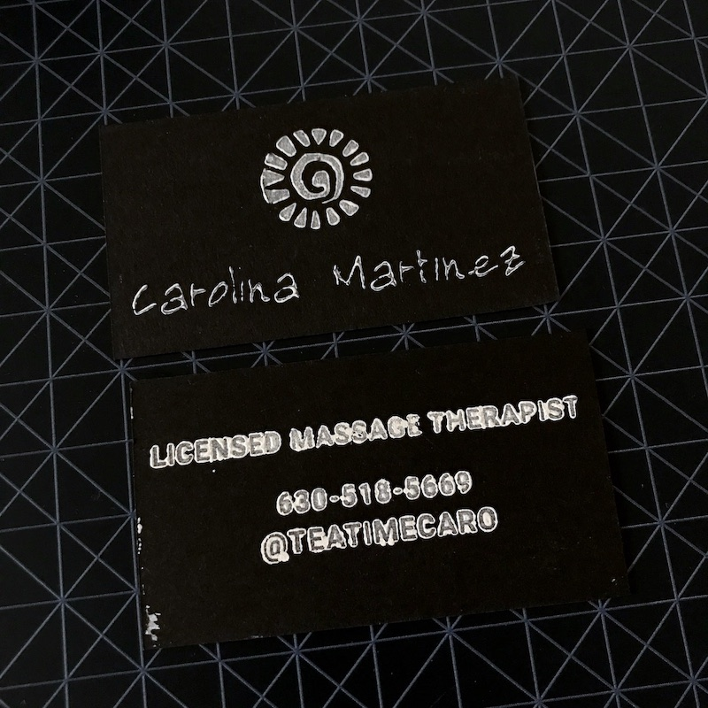
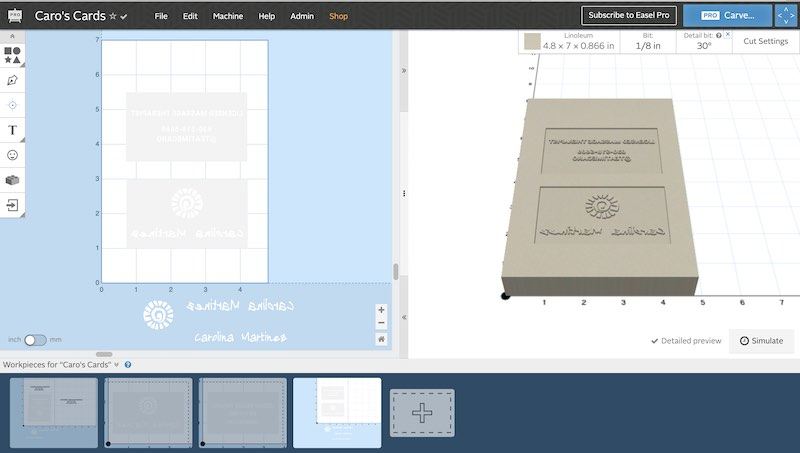
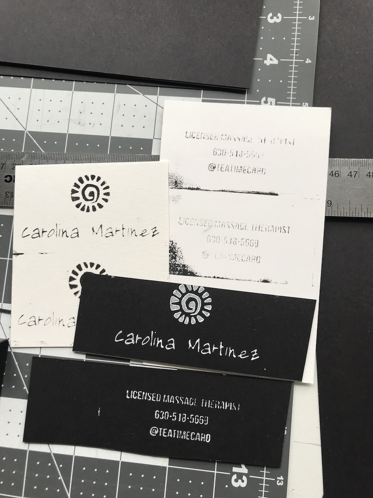

# Business Card Stamps

## [Back to Home](https://gdiazfab.com/) or [Gallery](https://gdiazfab.com/gallery)

### Project 

Collaboration with [Carolina Martinez](https://www.instagram.com/teatimecaro/) to create a unique businesscard.

### Goal

I reached out to Carolina early 2020 to suggest a project collaboration. I wanted to make her a business card using desktop digital fabrication tools. The goal of the project was to make her unique business cards and help her promote her business while practicing my own skills. 

If you are in the Chicagoland area, definitely get in touch with Carolina she's an amazing massage therapist! 

If you are interested in learning how to make one or want to commission a stamp or set of cards, please send me a message! 

### Materials & Tools

Mounted linoleum blocks (various sizes), printing ink, brayer, x-acto knife, cardstock.
 
**Software:** Easel and Inkscape
 
**Tools:** X-Carve

### Design Files

**I recommend using design files as a resource rather than a template.**
 
[Easel Project Files](https://easel.inventables.com/projects/Egb5WShxxR2WaESdSvPT0w) 

### Process

I used Easel and Inkscape to get the design just right. We started in Easel and brought in the design elements. Using the Image Trace tool we imported her new logo and tried out different font styles. 

Once we decided on the font and overall layout, the entire image had to be inverted. Easel has great tools to facilitate the process. You can check out the project here. 

The initial carve was done with a 60 degree v-bit and it came out pretty nice. We did not carve out the entire rectangle at first. This was done for two reasons: to save time and to  get a sense of the actual depth needed for the ink to stamp. When we went to cut out the first version, somehow the top layer of the linoleum came right off the backing. It may have been due to aggressive cut settings or the adhesive on this block of linoleum being worn out (it was not a fresh piece of linoleum). 

The first version needed slight clean up and modifications. I used an x-acto knife to clean up the edges. The cut settings I used for this initial carve worked well, however, it was about 30+ minutes and the T-block was not suited for applying even pressure. I decided to work a bit more on the design and cut a few more blocks. 

I ended up exporting the design from Easel (File > Download .zip) and importing the .svg file in to Inkscape. I wanted the letters to be slightly bolder as the router was milling too much of the thin portions out. Although Easel has a great offset tool, I found Inkscape allowed me to have more control over the line thickness. 

One of my favorite parts of working with desktop digital fabrication tools is the turnaround time and reiterative process. Although I made about 4 different blocks in total, I did not have to wait for manufacturing, pay additional setup or redesign fees. Instead, working with desktop digital fabrication tools allows me to prototype and create a finished product within hours or days at very little cost. 

<!--- need to add video, upload to YT and link -->

I found that cutting .04" depth was enough to transfer ink to the paper. I used a 2-stage carve and here are the cut settings I used on the final carve: 

Once I found the combination of font, size, spacing and cut settings that looked the best, I was ready to begin the actual printing process. 

Although I am familiar with the block printing process, I do not have extensive experience with the technique. I won't lie, it is a very labor intensive task but so very rewarding. I started by cutting out my sheet of cardstock into 2" x 3.5" pieces. I would recommend a paper cutter but I used a x-acto knife and straight edge to cut out a bit over 50 pieces. I started with one side, ink, press, ink, press and lots of drying time. It was so rewarding to see how each card had unique characteristics. 

<!--- need to add video, upload to YT and link -->

This project took about two weeks to complete. It can easily be done in a weekend if you source all of your materials from the start. Carving the blocks can be time consuming and that is why I would recommend doing sections at time when you are trying to get the right depth. Carving and stamping time combined was about 4-5 hours. This is not including the designing and various trials but now I have a stamp and design than I can reuse over and over! 

<a href="#top"> Back to top </a>
