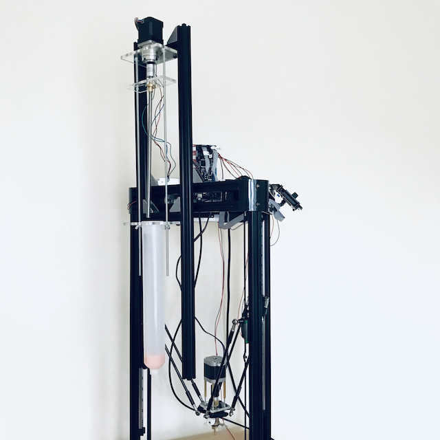
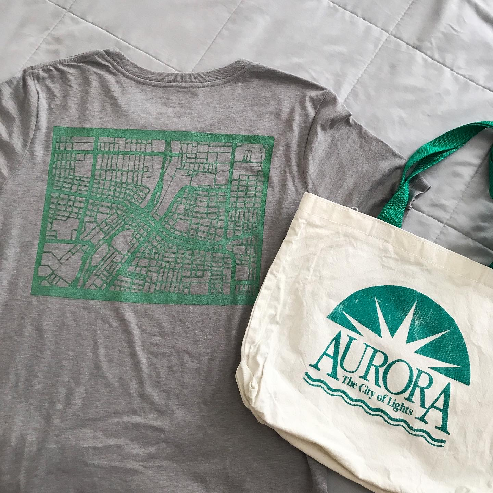
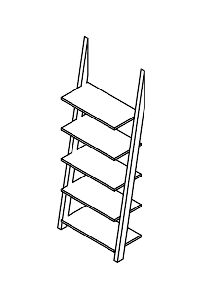
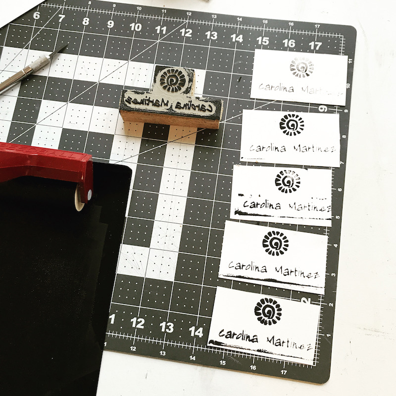

<main>
<!-- ***********************  ABOUT / PROFILE  *********************** -->
	<header>
		

  <h1> 
    <a href="/index"> Giovanna Diaz Fabiani </a> 
  </h1>
     <h2> Digital Fabrication &#x2022; Design &#x2022; Training</h2> 
      
 <!-- <h2> Guías [Documentation]</h2> -->
<!--  <ul class="contact-list"> --> 
  
Back to<a href="/" > Galería [Gallery] </a> 

 <!-- 
 <a href="/">Galería</a> 
 -->
 <!-- <li> <a href="/gallery">Gallery</a> </li>  -->
		

	</header>

<!-- ********************  PROJECTS ********************* -->
<section class="projects">

  <h2>Guías [Documentation]</h2>
  
I enjoy exploring repetition, abstraction and themes from social theory. I use X-Carve/X-Carve Pro, Ender 3 Pro 3D printer, Cricut vinyl cutter and various open-source software. This is where I will attempt to document and share my work in progress. 

  <h3>Other Sites</h3>
    <a class="btn" href="https://www.thingiverse.com/gdiazfab/designs" target="_blank">Thingiverse</a>
    <a class="btn" href="https://wikifactory.com/@gdiazfab" target="_blank">Wikifactory</a>

<!-- <section class="projects"> 
    

      <h2>Galería [Gallery] h2> 

For work-in-progress check out <b><a href="/projects">Projects.</a></b>

Copy the whole <section> block to add more projects. -->
<section class="project-item">
    

      
      <h3>Ceramic 3D Printer</h3>
      
My attempt of modifying an Anycubic Linear Kossel kit to extrude clay.   
         
      <b>Goal:</b> To produce viable ceramic sculptures without the need for a throwing wheel or the mold-making/slip casting method. 

       
      <a class="btn" href="https://wikifactory.com/@gdiazfab/anycubickossel-to-ceramic" target="_blank">View Project</a>
    

  </section> 

<!--    End of Project block. -->
<section class="project-item">
  

    
  <h3>Aurora, IL map screenprints (2021)</h3>
  
Experimenting with printing techniques: carving lino on my X-Carve and screenprinting with vinyl cutter.

  <a class="btn" href="/projects/vinylscreenprint">View Project</a>

</section>

<!--<section class="project-item">
  

  
  <h3>CNC Cut Leaning Shelf (2021)</h3>
  
Cutting a leaning shelf using Easel Pro and the X-Carve Pro

  <a class="btn" href="/projects/leaningshelf">View Project</a>

</section>-->

<!-- Copy the whole <section> block to add more projects. --->
<section class="project-item">

  
  <h3>Lightbox for Tess (2020)</h3>
  
 Adding lights to a painting.

  <!--
My attempt of modifying an Anycubic Linear Kossel kit to extrude clay.   
     
  <b>Goal:</b> To produce viable ceramic sculptures without the need for a throwing wheel or the mold-making/slip casting method. 
 
    -->
  <a class="btn" href="/projects/lightbox">View Project</a> 

</section>
<!--  ****** End of Project block.  ******-->
<section class="project-item">
  

  
  <h3>Business Cards Stamp (2020)</h3>
  
Milling Linoleum with X-Carve to create a custom business card.

  <a class="btn" href="/projects/bizcards">View Project</a>

</section>
<!-- Uncomment and copy block for more projects 
<section class="project-item">
  

    
  <h3>Business Cards</h3>
  
Summary or description of the project and/or your role in it. Add as many paragraphs as you need.

  <a class="btn" href="#" target="_blank">View Project</a>

</section> -->
<!-- End of Project block. -->

</section>   

<!-- *****************  CONTACT INFO / SOCIAL MEDIA  ***************** -->
<footer class="footer">
   

      <h2>Contact</h2>
      
¡Gracias por visitar! [Thank you for stopping by!]

      
 Para contratar trabajo envie correo: <a href="mailto:gdiazfabiani@gmail.com">gdiazfabiani@gmail.com</a>
      
If you're interested in working together, please email me.

     <!-- 
 I have experience designing and prototyping with artists and entrepreneurs, realizing their ideas through desktop digital fabrication technology. I am open for collaborations, digital fabrication prototyping, file setup and digital design consultation.

     
My most recent work is focused less on creating sculptural objects and rather on building my own machines which will be used to create sculptures. Recently, I put together a ceramic 3D printer and aim to test the possibility for repetition without the use of slip casting techniques. 
      Through this project I have gained insight on programming, engineering, and prototyping. It has also given me an opportunity for collaboration with the online Maker community
-->

<!-- Social media and contact links. Add or remove any networks. -->
  <ul class="contact-list"> 
  <!-- Add font awesome icons -->
<li></li>
<li> </li> 
<li></li>
<li></li> 
</ul>

Giovanna Diaz Fabiani 2022

  <!--<li> <a href="mailto:gdiazfabiani@gmail.com">Email</a> </li>
  <li> <a href="https://github.com/giovannadf" target="_blank">GitHub</a> </li>
  <li> <a href="https://instagram.com/gdiazfab" target="_blank">Instagram</a> </li>
  <li> <a href="https://www.linkedin.com/in/gdfabiani/" target="_blank">LinkedIn</a> </li>-->