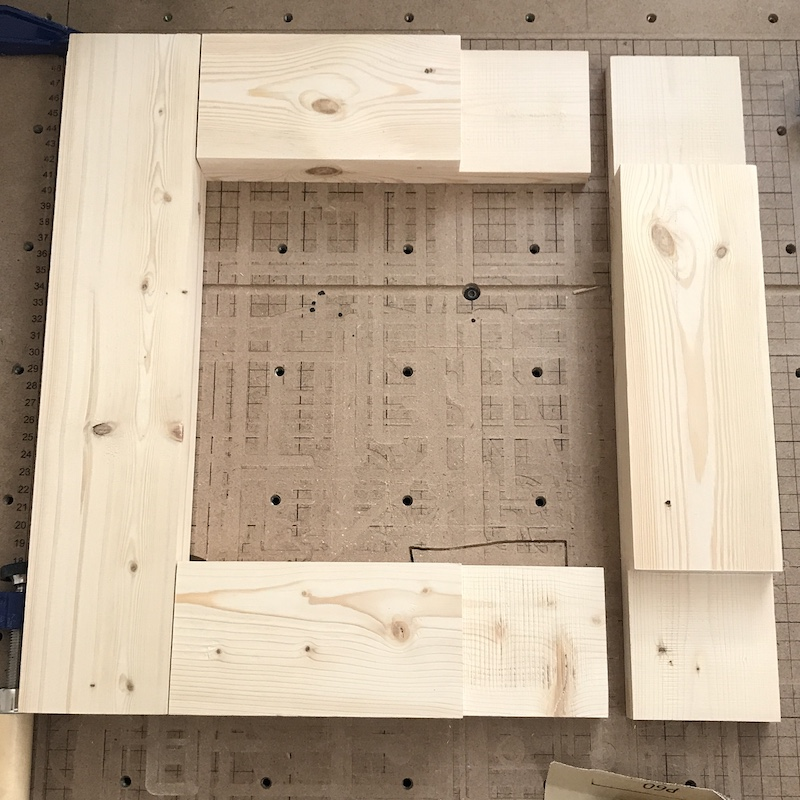

{::options parse_block_html="true" /}
<!-- MD is getting ignored, not sure how to fix it. Do I need a different class or div? or remove it all together? 

Correction: Default layout is using the global styles in the CSS -->

<main>
<!-- ***********************  ABOUT / PROFILE  *********************** -->
<header>

  <h1> 
    <a href="/index"> Giovanna Diaz Fabiani </a> 
  </h1>
  <h2> Projects & Work in Progress </h2>
  <ul class="contact-list"> 
  <li> <a href="../index">Home</a> </li>
  <li> <a href="../gallery">Gallery</a> </li>
  <li> <a href="/projects">Projects</a></li>
  </ul>

</header>

</main>

<!---START PROJECTS--->

<section class="projects">

 
# Lightbox for "There's a fire in your backyard" by Tess Cramer 
 
 

## Project Description  

First version of lightbox that illuminates a glass painting done by [Tess Cramer](https://www.instagram.com/tessctess/).

## Goal

I wanted to create a slim lightbox using as many recycled materials and my CNC machines. I had some leftover LED lightstrips, 2" x 4" boards to create the frame. I also wanted all the wires to be hidden and the lights to make it seem as the entire frame was glowing. 

## Materials & Tools

2" x 4" plywood scraps
12" LED strip
12v LED battery power supply with switch
PLA for 3D printed LED holder
glue, soldering tools, milling bits and lots of patience during prototyping.
 
**Software:** Easel, Cura, Fusion360
 
**Tools:** planer, table saw, X-Carve 750mm, Flsun cPlus (prusa clone)

## Design Files

**I recommend using design files as a resource rather than a template.**
 
[Easel Project Files](https://easel.inventables.com/projects/STFHkGR5D4s8l6dMdQDdWQ)
 
Fusion 360 Files not quite ready, need to clean them up. 

## Process

The idea started when I purchased the original artwork by Tess. When she told me about the project, I got so many ideas on how to display the work as she envisioned it. I have been wanting to do collaborations with other artists and practice my own design skills (a.k.a. ignoring my own art projects). In this work, she is playing with the idea of light transmission and it is an amazing piece when held up against a window or a very lightbulb. I wanted to capture that in the slimest lightbox possible and also try to create something original myself. At first, I did not want to create a traditional lightbox as it was too easy in my mind. I wanted to reference this [project](https://www.inventables.com/projects/cherry-wooden-picture-frame) but the design shifted severely.

Here are prototypes and sketches of my original vision: 

<!---  if you want to resize images use this format, thx --->

You can see my first mistake here (or maybe not). The way I mirrored these boards did not allow them to line up and the magnets would not clip together. I had to rotate and cut these a second time to make sure they fit. Overall, this concept was good but it did not consider any of the electronics or how it would be hung up on display. I would love to revisit this idea in the future. 

At this point, I was frustrated so I decided to move on to another portion of the assembly. The electronics and LED holder. I purchased the battery power packs and while on their site found the [technical drawing](https://www.superbrightleds.com/moreinfo/aluminum-channels/45-alu-led-strip-channel-corner/2041/#tab/specifications) to their LED strip channels. This gave me a great idea and I wanted to replicate my own custom holders so I got to work. 

This is the initial sketch and prototype:

I was happy with the initial design and how the mounts held up the LED light. I had delayed this project long enough so I gave in away from my ultra light box. I went into the shop, planed a few scrap 2" x 4" boards and googled how to create half lap joints. Found this awesome [youtube video.](https://www.youtube.com/watch?v=Klpn-LutJf8)

Cut these up, sanded them and glued them for 24 hours.

  

I know these half lap joints could have been done on my X-Carve easily. For this version of the project, I took it as an opportunity to learn another joint and plus it *seemed* to be quicker but I can't say for sure since I haven't tried designing it and actually going through the material setup. 

Once my stock was ready to be cut, I designed a cutout to make the frame slimmer, the battery pack pocket and an inset for the glass to mount into. I also added pockets for the small magnets that would hold the "back" and "front" of the frame. There is an additional "hidden" pocket under the frame for the on/off switch to be toggled. 

Now that I had my frame pretty much finished, I need to figure out how the LED would actually mount. I was trying to decide if the frame would be top, side, or bottom lit. Top lighting was not the best: 

Top lighting | Bottom lighting
------------ | ---------------
 | 

The important part here was the 45 degree angle so the light would bounce from the wall back onto the glass. I learned this after holding the LED light and realizing light coming straight down would not create illumination. Here are all the versions I made on my 3D printer:  

That's it! Now you know the secret of how this lightbox works. 

I did not document the soldering portion but I needed to shorten the LED wires. I think this project can get even slimmer, I want to make the frame disappear as much as possible but still being able to keep the LED illumination. If you have any ideas or suggestions, I'm open to it! I would love to collaborate and create new products to share with everyone. 

Hope you enjoyed this project!  

<a class="btn" href="#top">Back to top</a> 
<!--<a href="#top"> Back to top </a>-->
