{::options parse_block_html="true" /}

<main>
<!-- ***********************  ABOUT / PROFILE  *********************** -->
<header>

  <h1> 
    <a href="/index"> Giovanna Diaz Fabiani </a> 
  </h1>
  <h2> Projects & Work in Progress </h2>
  <ul class="contact-list"> 
  <li> <a href="/" > Galería </a></li>  
  <li> <a href="/projects">Guías [Documentation]</a></li> 
<!--  <li> <a href="../index">Home</a> </li>
  <li> <a href="../gallery">Gallery</a> </li>
  <li> <a href="/projects">Projects</a></li> -->
  </ul>

</header>

</main>

<!---START PROJECTS--->

<section class="projects"> 
 

  

# Aurora, IL map screenprints
 

## Project Description  

I was experimenting with different printing techniques. I tried to use linoleum and fabric inks but it was not working very well. I do not have access to a dark room so I purchased a screen print and layed a vinyl cut over it as a mask rather than using the emulsion method. This project outlines my process. 

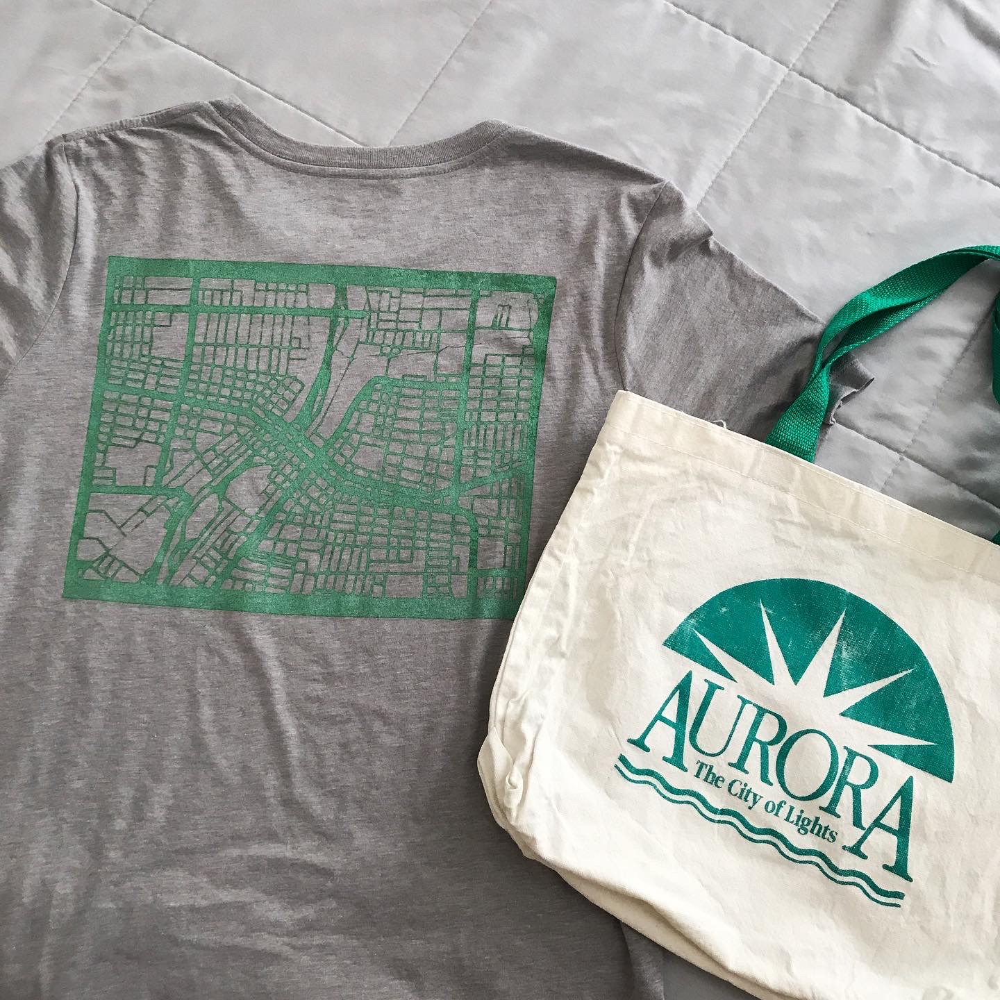

## Goal

Print map of Aurora, Illinois on a t-shirt and canvas bag.

## Materials & Tools

Fabric Inks: [Jacquard Fabric Inks](https://www.dickblick.com/products/jacquard-textile-colors/) and [Speedball Screen Printing Ink](https://www.dickblick.com/products/speedball-fabric-screen-printing-inks/) 

[Gray Bella Canvas t-shirts](https://shop.bellacanvas.com/products/mens-the-triblend-crew-tee) 

Brayer, Screen, Vinyl I had on hand. 
 
**Software:** Easel and [https://snazzymaps.com](https://snazzymaps.com)
 
**Tools:** Cameo Vinyl Cutter, tweezers, clamps and a iron to heatset ink

## Design Files

**I recommend using design files as a resource rather than a template.**
 
Easel Project Files: 
[Aurora Stamp](https://easel.inventables.com/projects/Q2H0ILM0XlY1t49HNzjV1w) 
[Large Press](https://easel.inventables.com/projects/dDR8MWONvUG3jF-LVxFfDw)

## Process

Started with importing an SVG of the Aurora map into Easel. Snazzy maps makes it very user friendly to create black/white maps. After inverting the image (Edit> Flip Horizontally), I experimented with various cut settings and bits before deciding on doing a two-stage carve with 1/16" and 1/32" downcut bits. 

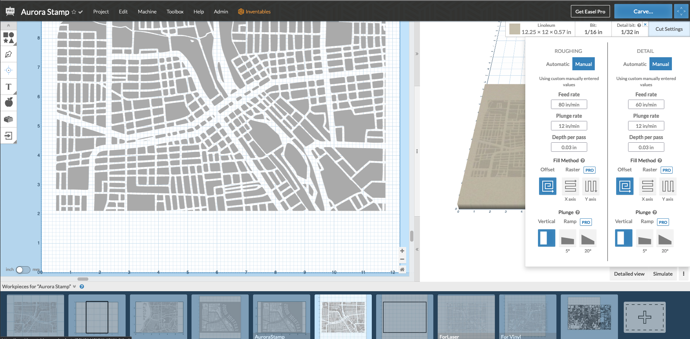

I carved on a block of linoleum, I wanted to go down through the lino so my cut as very deep. I don't think it needs to be cut to the same depth but you may want to experiment. 

----
Mixing the ink to match the color on the original canvas bag was quite a challenge. I purchased a variety of greens and primary colors to get it just right. 

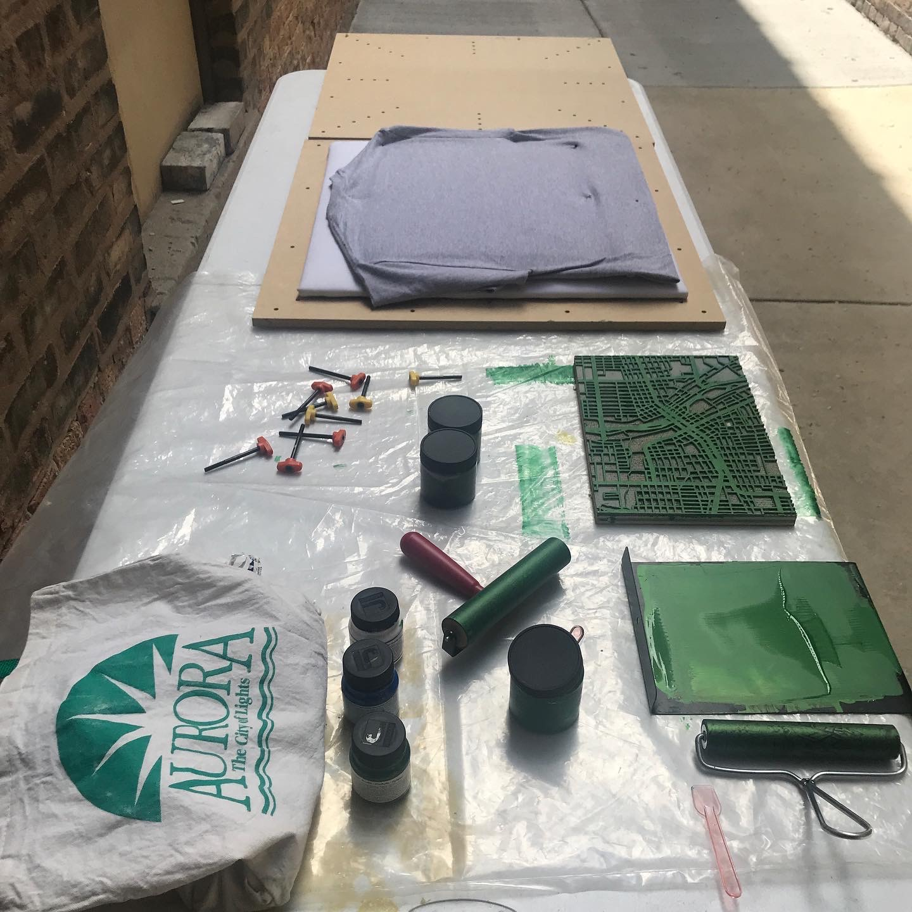

Having no fabric printing experience, I thought it would work very similarly to paper but I was definitely mistaken. The fabric ink dried very fast on the lino block. I reached out to [@jennaleighrichards](https://www.instagram.com/jennaleighrichards/) for suggestions in printing with fabric. She recommended adding more even pressure and even a backing with batting to allow for pressure. We decided to create a large MDF press. It would consist of a top panel of MDF with holes at various positions for screws to go through and the bottom panel would have threaded inserts for the screws to secure. 

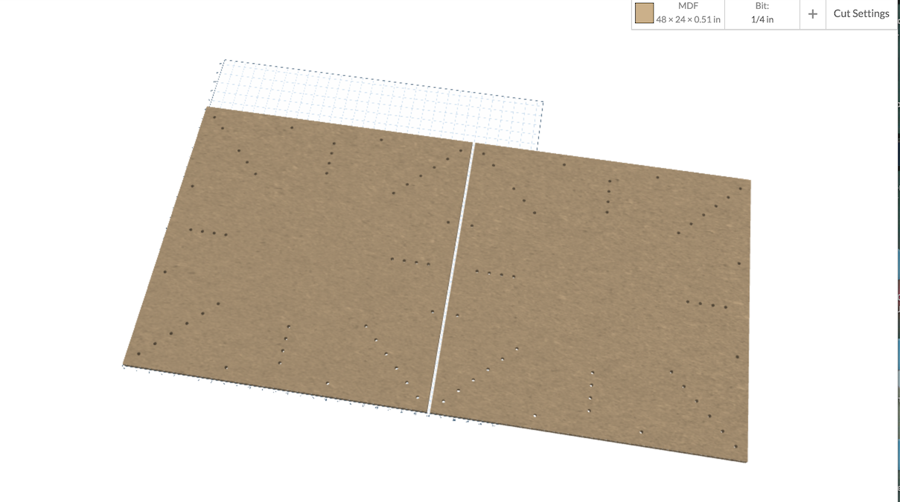 
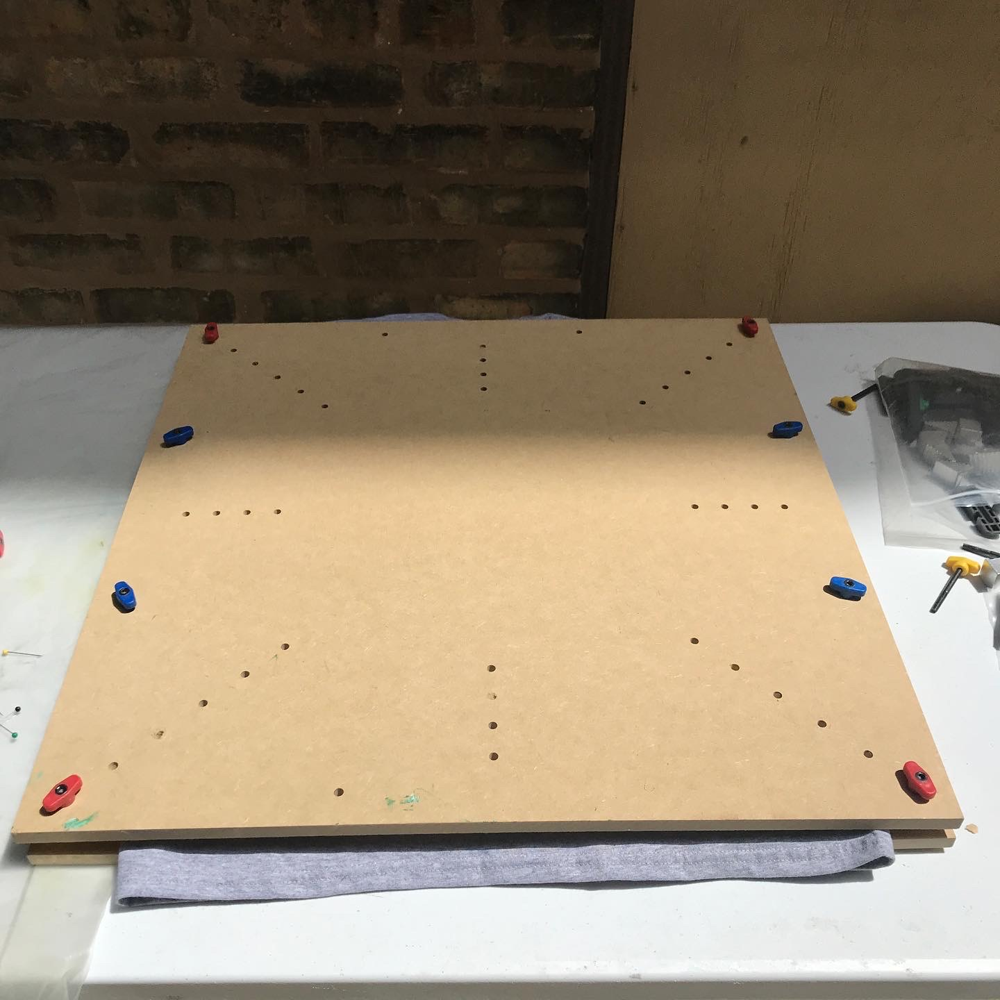

Tried the press a few different ways but the ink was still drying too fast on the lino block and printing inconsistently. I wanted solid lines.  

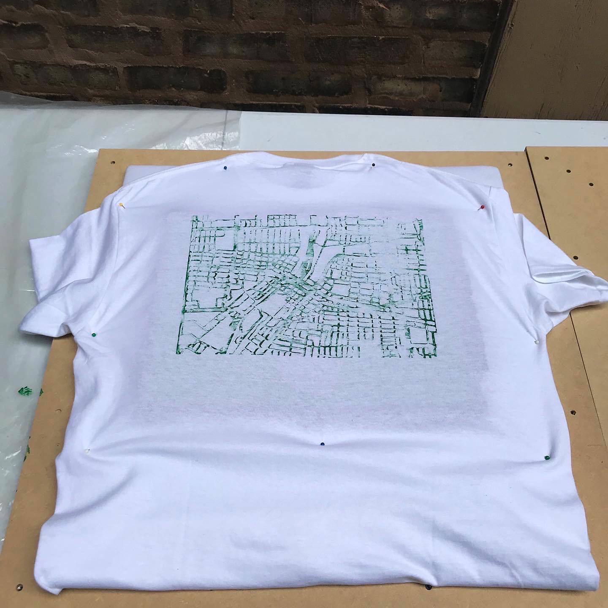

----
Fast forward to a few weeks later. I purchased a Speedball ink which had a thinner consistency. The color was deeper but close enough to the emerald green I was looking for. This ink was still not really working on the lino block so I decided to try a different method: screenprinting.

I purchased a screen from Blick and vinyl to use with the Cameo vinyl cutter. I exported the SVG file from Easel (Project > Download .zip > unzip and save the SVG only) and brought it into Cameo software. The SVG file must remai "inverted" to ensure it prints correctly when the screen is flipped and inked.

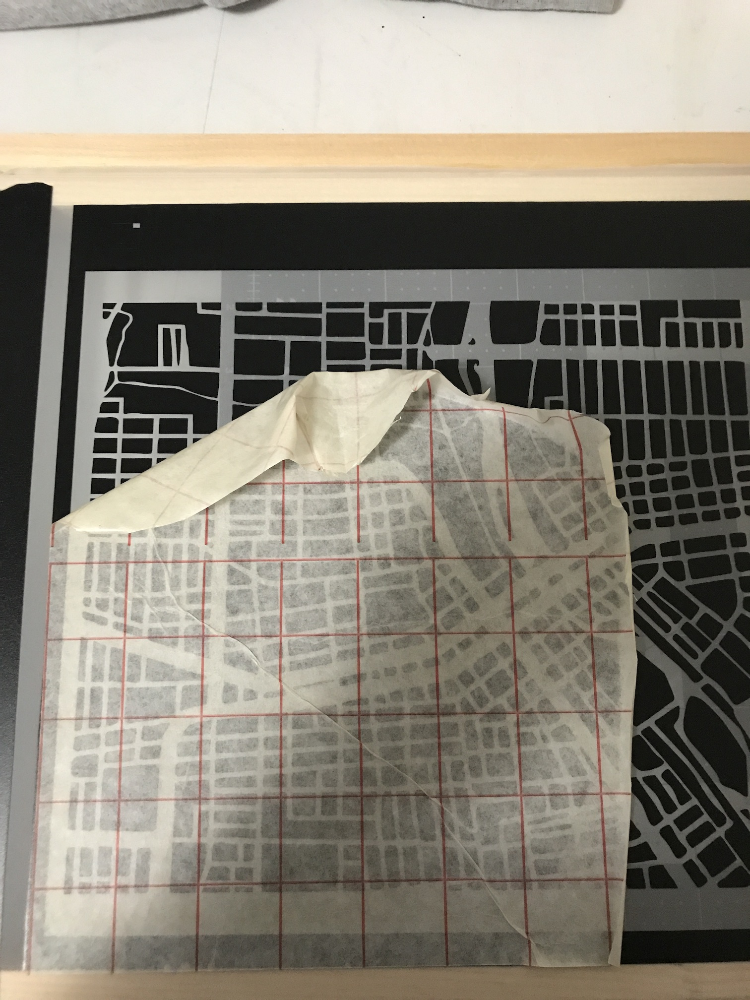

Carefully peeled away the vinyl to expose the screen on the parts I wanted inked. The last step is to press on transfer tape, lift the vinyl from its backing and adhere to the screen. I also taped around the edges to create a frame around the map. When removing the transfer tape, some of the vinyl wanted to lift away from the screen. I had to remove this very slowly (con paciencia). 

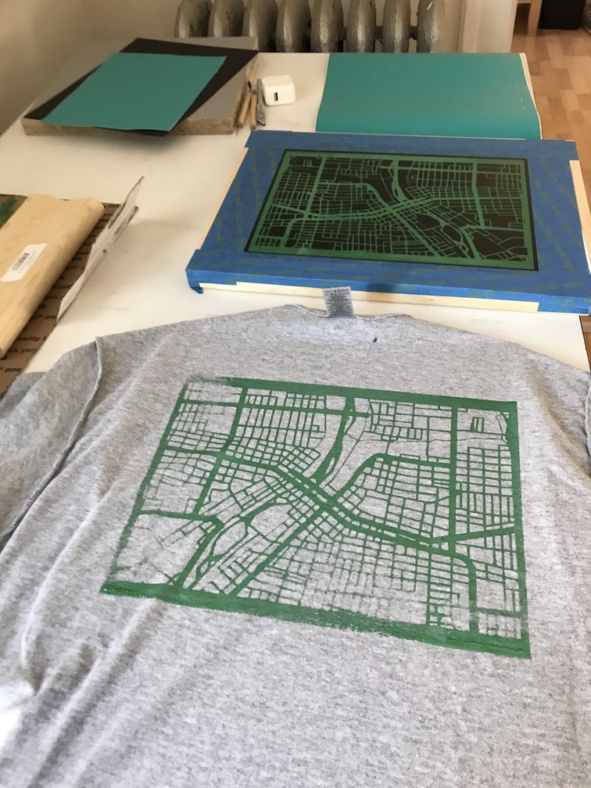 | 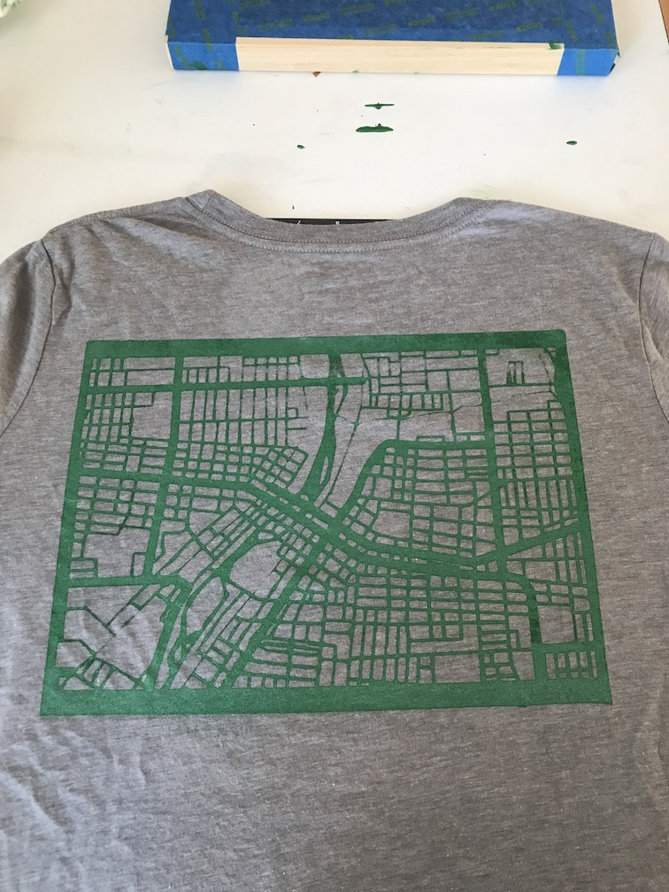 | 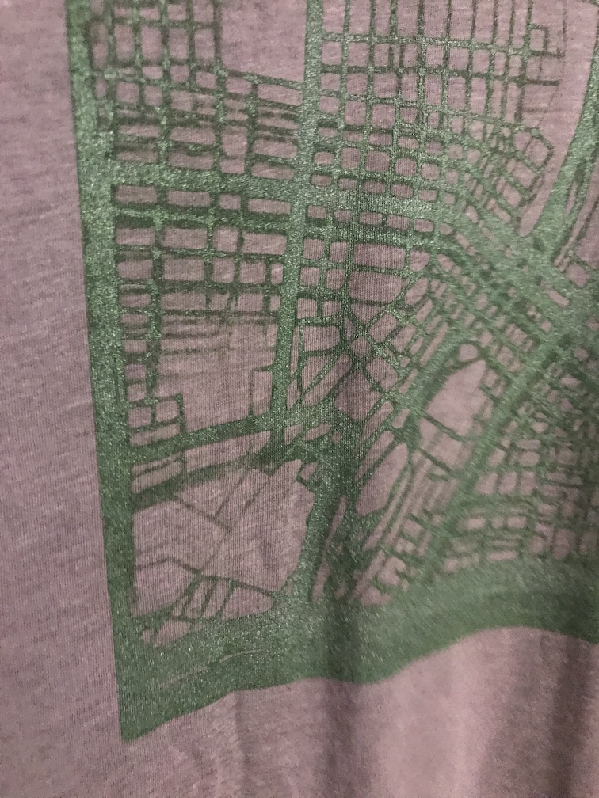

The screenprinting seems to work best on fabric that has less texture. 

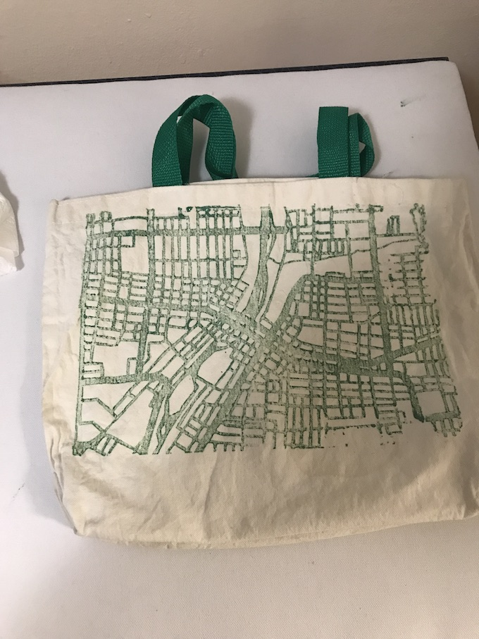

I used cardboard inside the t-shirt to prevent ink from seeping to the front. Took a few tries to get the hang of running ink down the screen but over all, I think this was the best method. 

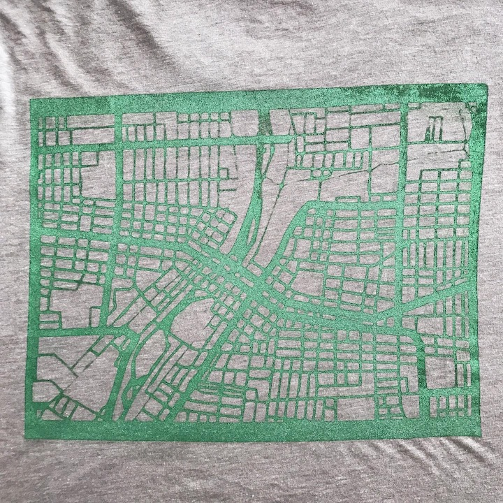

Hope you enjoyed this project!  

<a class="btn" href="#top">Back to top</a> 
<!--<a href="#top"> Back to top </a>-->
